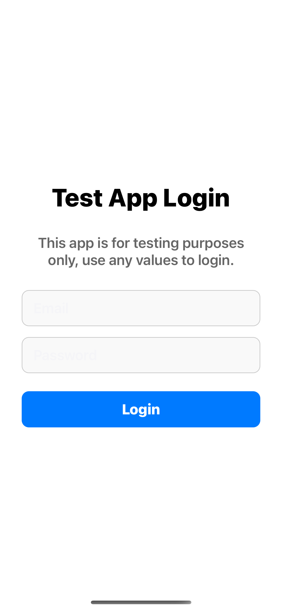
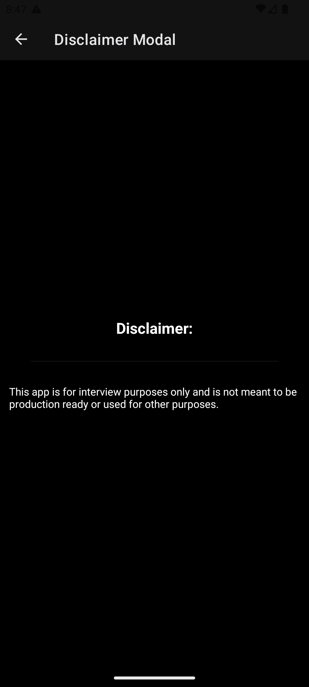
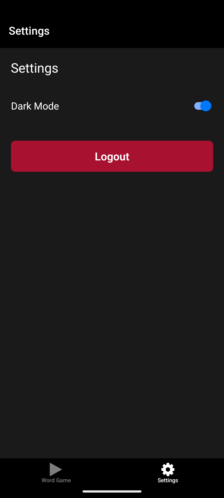
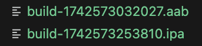

# Test Engineer Take Home Exam

Welcome to the Test Engineer Take Home Exam! Please follow the instructions below to complete the assignment.
Please feel free to ask any questions if you get stuck along the way! This take home exam should take no longer than 1 hour (not including the Bonus Section)

## Instructions

1. **Clone the Repository**
    ```bash
    git clone https://github.com/bluevoiceio/mobile-test-eng-take-home.git
    cd mobile-test-eng-take-home
    ```
    - 1a. Install dependencies: `npm install` (Node version 20+)
    - 1b. Run the app: (see `package.json` for all scripts)  
        - `npm run web`  
        - `npm run ios`  
        - `npm run android`  

2. **Create a Test**
    - Create an e2e test of this mobile app using either Maestro, Appium OR any framework capable of testing physical mobile devices. (Tests can be run using emulators, but frameworks such as Playwright are not allowed since Playwright cannot test on real devices.)
        - It must run successfully on both Android and IOS

3. **Run Your Test**
    - Execute your test and record videos of the test run-throughs.
    - Save the videos in a directory named `test-videos`.

4. **Submit Your Work**
    - Commit your code changes and videos.
    - Push your changes to a new branch.

5. **Open a Pull Request**
    - Open a PR OR send us a link of your own version in github.
    - Ensure your PR includes:
      - Notes describing your process
      - Code changes
      - Videos of test run-throughs
      - Explain everything that you have done and what you would do if you had more time: be concise and specific.

## Bonus

- **Create a GitHub Action**
  - Set up a GitHub Action that runs your tests automatically on each push.
  - Include the configuration file in your PR.

Thank you for your effort and good luck!

---
## Screenshots:




Proof that mobile app is buildable using package.json scripts: 

